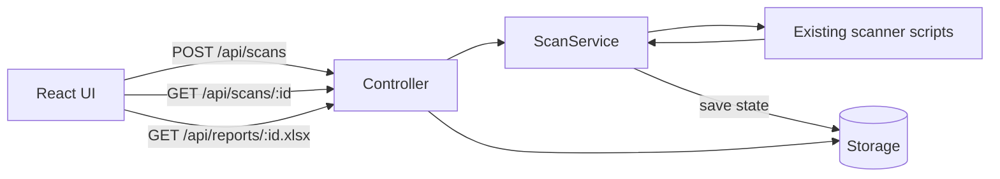

# SecVal Blueprint: Streamlit to React + MVC

## 1. Goals
- Migrate UI from Streamlit to JavaScript frontend (recommended: React + Vite).
- Keep scanner core logic reusable from existing Python scripts.
- Adopt clean MVC boundaries with an explicit Service layer.
- Preserve Docker-first deployment model because nmap is required.
- Avoid big-bang rewrite; use phased migration.

## 2. Recommended Target Stack
- Frontend: React + Vite + TypeScript.
- Backend API: FastAPI.
- Async jobs: Start simple with in-process background tasks, then move to Celery/RQ if needed.
- Storage:
  - Phase 1: in-memory job state + temporary files.
  - Phase 2: PostgreSQL for scan metadata and history.
- Container:
  - backend service (Python + nmap)
  - frontend service (Node build, static serving)
  - optional nginx service (reverse proxy, TLS termination)

## 3. Architecture (MVC + Service)
- Model:
  - Domain entities and schemas for Target, ScanRequest, ScanResult, Vulnerability, Report.
  - Validation and serialization (Pydantic).
- View:
  - React pages/components only for presentation and UI state.
- Controller:
  - FastAPI routes handling HTTP requests and response shaping.
- Service:
  - Orchestrates scanner execution, result normalization, report generation.
- Repository (optional in Phase 1, mandatory if DB added):
  - Abstracts persistence for scans/reports.

## 4. High-Level Flow


## 5. Proposed Repository Structure
```text
SecVal/
  backend/
    app/
      main.py
      core/
        config.py
        logging.py
        errors.py
      models/
        scan_models.py
      schemas/
        scan_schemas.py
      controllers/
        scan_controller.py
        health_controller.py
        report_controller.py
      services/
        scan_service.py
        result_mapper.py
        report_service.py
      repositories/
        scan_repository.py
      workers/
        scan_worker.py
      adapters/
        legacy_scanner_adapter.py
    script/                  # migrated/reused from current script/
    utils/                   # migrated/reused from current utils/
    requirements.txt
    Dockerfile

  frontend/
    src/
      app/
        routes.tsx
      pages/
        ScanPage.tsx
        ResultPage.tsx
      features/
        scan/
          ScanForm.tsx
          ModuleSelector.tsx
          scanApi.ts
        results/
          ResultTable.tsx
          SummaryCards.tsx
          reportApi.ts
      components/shared/
      types/
      lib/
    package.json
    Dockerfile

  infra/
    docker-compose.yml
    nginx/
      default.conf
```

## 6. API Contract (Phase 1)
- `GET /api/health`
  - Returns service health and dependency checks.
- `POST /api/scans`
  - Body: targets + selected modules.
  - Returns `scan_id` and status.
- `GET /api/scans/{scan_id}`
  - Returns status (`pending|running|done|failed`) + normalized results.
- `GET /api/scans/{scan_id}/summary`
  - Returns per-module counters.
- `GET /api/scans/{scan_id}/report.xlsx`
  - Returns generated XLSX report.

Example request:
```json
{
  "targets": ["example.com", "https://target.tld"],
  "modules": [
    "SSL Certificate Check",
    "SSL Certificate Hostname Mismatch",
    "TLS 1.0 Detection",
    "Security Headers Check"
  ]
}
```

Example status response:
```json
{
  "scan_id": "d6f0e4f4-20a3-42f6-bfcb-bf1f9b8a1f0b",
  "status": "running",
  "progress": {
    "completed_modules": 2,
    "total_modules": 4
  },
  "results": {}
}
```

## 7. Mapping Current Code to New Layers
- Keep scanner logic as-is (minimize risk):
  - current `script/*` and `utils/scanner_engine.py` become backend internals.
- Replace Streamlit UI layer:
  - current `app.py` and `components/ui_*` replaced by React frontend.
- Add adapter layer:
  - `legacy_scanner_adapter.py` wraps current scanner outputs and normalizes formats.

## 8. Result Normalization Rules
- Standard result envelope for every module:
```json
{
  "module": "Security Headers Check",
  "target": "https://example.com",
  "status": "secure|warning|insecure|error",
  "severity": "info|low|medium|high",
  "details": "...",
  "raw": {}
}
```
- Keep existing raw fields for backward traceability.
- Normalize inconsistent statuses (`Error`, `ERROR`, `WARNING`) into canonical enum.

## 9. Migration Plan (No Big-Bang)
- Phase 0: Baseline
  - Freeze feature scope.
  - Add regression test targets and expected outputs.
- Phase 1: API wrapper
  - Introduce FastAPI service.
  - Reuse existing scanner engine and scripts.
  - Expose scan and report endpoints.
- Phase 2: React frontend
  - Build scan form, progress panel, result tables, XLSX download.
- Phase 3: Hardening
  - Add persistence (PostgreSQL), retry, timeout controls, structured logging.
- Phase 4: Infra stabilization
  - Optional nginx reverse proxy.
  - Health checks, resource limits, and security headers.

## 10. Docker Topology Options
- Option A (simplest, no nginx)
  - `frontend` on 3000
  - `backend` on 8000
  - Browser calls backend directly via CORS.
- Option B (production-friendly)
  - `nginx` on 80/443 routes:
    - `/` -> frontend static
    - `/api` -> backend
  - Better caching and TLS termination.

## 11. Suggested Compose Targets (Future)
```yaml
services:
  backend:
    build: ./backend
    ports: ["8000:8000"]

  frontend:
    build: ./frontend
    ports: ["3000:3000"]
    depends_on: [backend]

  # optional
  nginx:
    image: nginx:stable-alpine
    ports: ["80:80"]
    depends_on: [frontend, backend]
```

## 12. Engineering Guardrails
- Controllers cannot import frontend or UI code.
- Views cannot execute scanner scripts directly.
- Services are the only orchestration point for multi-module scans.
- Use typed schemas for all API I/O.
- Keep module names and keys centralized in one enum/constants file.

## 13. Risks and Mitigations
- Risk: Inconsistent output format among scanner modules.
  - Mitigation: result mapper + golden test fixtures per module.
- Risk: Long-running scans block worker.
  - Mitigation: async job model and timeout policy.
- Risk: nmap dependency reduces hosting options.
  - Mitigation: keep Dockerized backend and self-host/VPS deployment path.

## 14. Definition of Done (Migration)
- Streamlit dependency removed from runtime path.
- All current modules callable from `/api/scans`.
- React UI can run scan, show progress, render module results, and download XLSX.
- Docker compose can bring up full stack successfully.
- Baseline regression test set passes for key scan modules.
