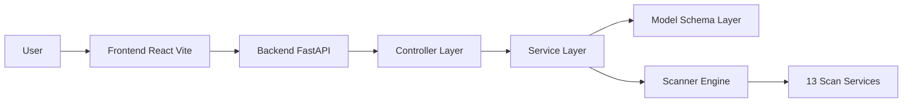

# SecVal

SecVal adalah aplikasi vulnerability scanner untuk web application.

## Arsitektur



## Service Scan yang Tersedia

1. SSL Certificate Check
2. SSL Certificate Hostname Mismatch
3. SSLv3 Detection
4. TLS 1.0 Detection
5. TLS 1.1 Detection
6. Response Code Check
7. HSTS Security Check
8. Security Headers Check
9. Cookie Secure Flag
10. Cookie HttpOnly Flag
11. Laravel Debug Mode
12. Node.js Debug Mode
13. PHP Version Disclosure

## Cara Menjalankan

### Opsi 1: Docker (Paling Mudah)

```bash
docker compose up --build
```

Akses:

1. Frontend: http://localhost:3000
2. Backend API: http://localhost:8000
3. API Docs: http://localhost:8000/api/docs

### Opsi 2: Jalankan Lokal (Dev)

Terminal 1 - Backend:

```bash
pip install -r backend/requirements.txt
uvicorn backend.app_fastapi:app --reload
```

Terminal 2 - Frontend:

```bash
cd frontend
npm install
npm run dev
```

Akses:

1. Frontend: http://localhost:3000
2. Backend API Docs: http://localhost:8000/api/docs

## Struktur Folder Inti

```text
SecVal/
  backend/
    app_fastapi.py
    controllers/
    services/
    models/
    schemas/
    utils/
  frontend/
    src/
  docs/
  docker-compose.yml
  Dockerfile
```

## Catatan

Gunakan hanya untuk target yang memang kamu punya izin testing.
